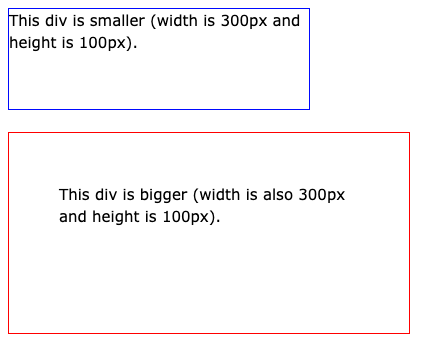

# What does \* { box-sizing: border-box } do? Advantages?

- Allows the inclusion of padding and border in an element's total width and height

Default width and height of an element is calculated:

width + padding + border = actual width of an element
<br/>
height + padding + border = actual height of an element

```css
.blue-div {
  width: 300px;
  height: 100px;
  border: 1px solid blue;
}

.red-div {
  width: 300px;
  height: 100px;
  padding: 50px;
  border: 1px solid red;
}
```



If setting box-sizing: border-box the padding and border are included in the width and height of an element.

```css
.blue-div {
  width: 300px;
  height: 100px;
  border: 1px solid blue;
  box-sizing: border-box;
}

.red-div {
  width: 300px;
  height: 100px;
  padding: 50px;
  border: 1px solid red;
  box-sizing: border-box;
}
```


