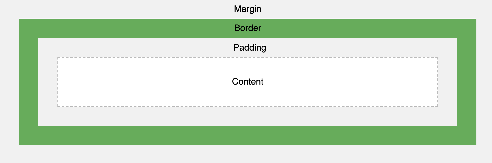

# What is the Box Model?

- Used to describe design and layout in CSS. It is essentially a box that wraps around every HTML element. It consists of: margins, borders, padding, and the actual content.

- Content: The content of the box, where text and images appear
- Padding: Clears an area around the content. The padding is transparent
- Border: A border that goes around the padding and content
- Margin: Clears an area outside the border. The margin is transparent
