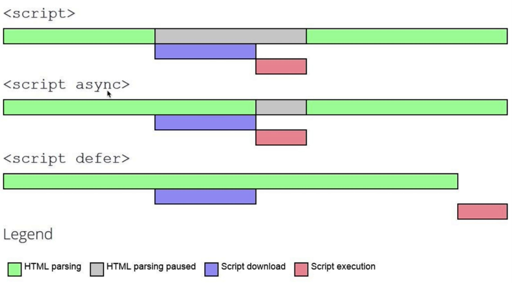

# Critical Render Path

- Refers to the time it takes after the initial get request to the server to render the page into the browser


JavaScript is render blocking so adding a async or defer attribute to the script tag can help with this. 
``` javascript
<script async>
 ```
Will use another thread to download the script and execute the script once it is downloaded. Typical rule is to add this when the JS doen't affect the DOM or the CSSOM. I.E analytics or tracking scripts

``` javascript
<script defer>
 ```
 Will use another thread to download the script and execute the script once the HTML has been parsed



### DOMContentLoaded

- Once the HTML, CSS adn the JS have been downloaded and parsed the DOMContentLoaded event is fired