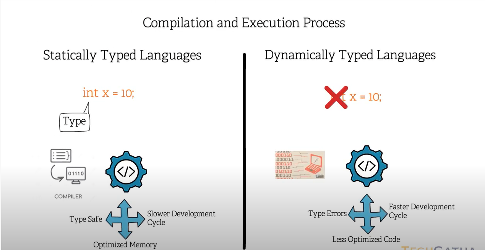

# Static vs Dynamic language

## Index

1. [Definition](##definition)
2. [Resources](##resources)

## Definition

- Static types languages have variables types delcared and is run through a complier. 

- Dynamic languages don't have variable types declared and are run through an interpreter at run time. 

## Resources
[Youtube](https://www.youtube.com/watch?v=jlUZw8-6ljw)

