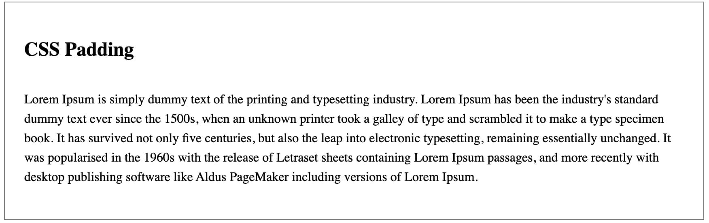

# Fundamentals

1. White Space - (negative space)the empty space between your elements
   

```css
div {
  border: 1px solid grey;
  padding: 1.5em;
}

h2 {
  margin-bottom: 1.5em;
}
p {
  line-height: 1.5em;
}
```

2. Color
3. Contrast - a strikingly different state from something else.
4. Scale - 
5. Alignment - Every element is positioned correctly in relation to other elements
6. Typography
7. Visual Hierarchy
