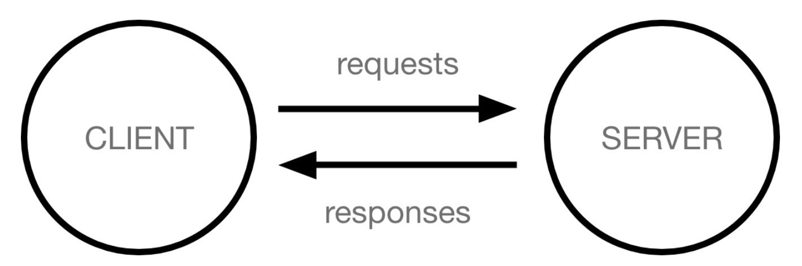

# How does the web work?

- Computers connected to the web are called clients and servers
   
  

## Clients

- internet connected devices and web accessing software available on those devices like a browser.

## Servers

- computers that store webpages, sites, or apps.

## Different parts of the web

Analogy: Client - house, Server - store you want to buy something from.

- Internet connection: Like the street from the house to the store.
- TCP/IP: Transmission Control Protocol and Internet Protocol are both communication Protocols that define how data should travel accross the interent. Like the tranportation mechanisms that let you place an order, go to the shop, and buy your goods. Like a car or bike you would use to get around.
- DNS: Domain name servers. Are like address books for websites. When typing in a website into the browser the browser looks at the DNS to find the websites actual address before it can get the site. Browser needs to find which server the site lives on so it can send an HTTP protocol. Like looking up the address of the shop so you can access it.
- HTTP: Hypertext transfer protocol. An application protocol that defines a language for clients and servers to speak with eachother. Like the language you use to order your goods.
